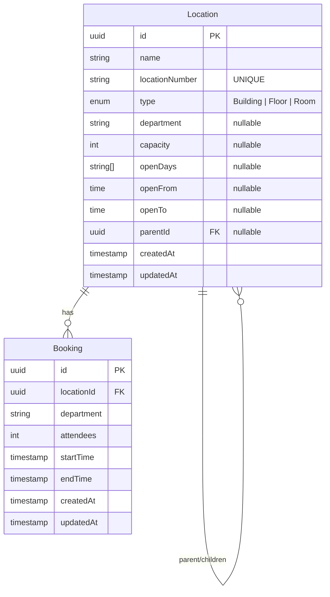

# Database Design

## Entity-Relationship Diagram (ERD)

## Description

- **Location**: Represents the hierarchical structure of physical spaces (Building -> Floor -> Room). It uses a standard self-referencing relationship `parentId` to form the tree structure. Only 'Rooms' (Locations without children) are typically considered "bookable".
- **Booking**: Represents a reservation made for a specific `Location`. It enforces business rules validating the department, capacity, and time.
